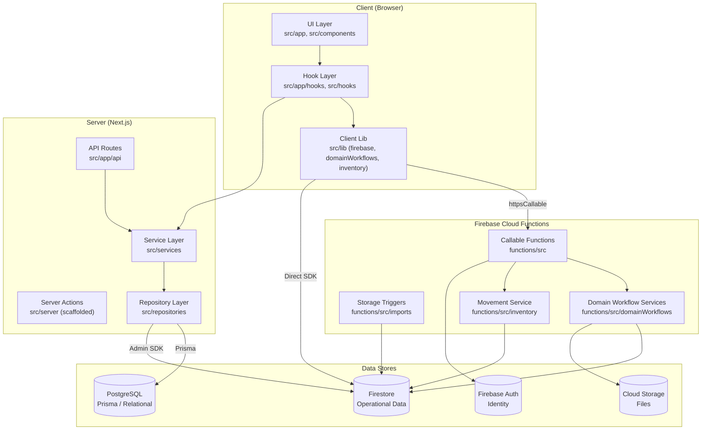
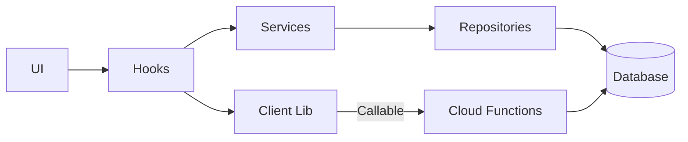
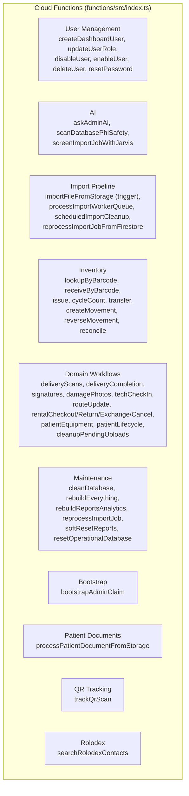

# Architecture — Advanced Home Medical Admin Dashboard

## Overview

The application follows a **layered architecture** documented in
`docs/v2-architecture.md`. The layers separate UI, business rules, data
access, authentication, and AI assistance. Firebase Cloud Functions serve
as the server-side enforcement layer for all high-risk operations.

## Layer Diagram



## Layer Responsibilities

### UI Layer (`src/app`, `src/components`)

- Renders pages and handles user interaction
- Shows loading, empty, and error states
- Calls hooks or services — never contains complex business rules
- Never directly performs high-risk database deletes

**Route groups:**

| Route group | Purpose |
|---|---|
| `src/app/(admin)/` | Authenticated admin pages (dashboard, inventory, patients, etc.) |
| `src/app/(auth)/` | Login and forgot-password pages |
| `src/app/api/` | Next.js API routes (chatgpt bridge, equipment, improvements, jarvis) |

### Hook Layer (`src/app/hooks`, `src/hooks`)

- Manages React state
- Subscribes to realtime Firestore data
- Calls services and Cloud Functions
- Converts service results into UI state

Key hooks:

| Hook | File | Purpose |
|---|---|---|
| `useAuthRole` | `src/app/hooks/useAuthRole.ts` | Firebase auth state + role resolution + permission checks |
| `useAppSettings` | `src/app/hooks/useAppSettings.ts` | Application settings |
| `useBarcodeScanner` | `src/hooks/useBarcodeScanner.ts` | Barcode scanner input |
| `useInventoryLookup` | `src/hooks/useInventoryLookup.ts` | Inventory lookup by barcode |
| `useSingleFlight` | `src/app/hooks/useSingleFlight.ts` | Prevents duplicate concurrent requests |

### Service Layer (`src/services`)

- Business rules and workflow orchestration
- Validation and cross-record decisions
- Calls repositories
- No JSX, no React imports

Services by domain:

| Service | Path |
|---|---|
| Audit Log | `src/services/audit-log/audit-log.service.ts` |
| Customer | `src/services/customer/customer.service.ts` |
| Equipment | `src/services/equipment/equipment.service.ts` |
| Equipment Dashboard | `src/services/equipment/dashboard.service.ts` |
| Equipment Model | `src/services/equipment-model/equipment-model.service.ts` |
| Inventory Jarvis | `src/services/inventory/inventory-jarvis.service.ts` |
| Inventory Return | `src/services/inventory/inventory-return.service.ts` |
| Pickup Review | `src/services/inventory/pickup-review.service.ts` |
| Jarvis (AI) | `src/services/jarvis/` (barcode-lookup, product-identification, product-image, web-search) |
| Location | `src/services/location/location.service.ts` |
| Manufacturer | `src/services/manufacturer/manufacturer.service.ts` |
| Patients | `src/services/patients/` |
| Products | `src/services/products/` |
| Rentals | `src/services/rentals/rental-par.service.ts` |
| Reports | `src/services/reports/` |
| Work Order | `src/services/work-order/work-order.service.ts` |

### Repository Layer (`src/repositories`)

- Database reads and writes
- Prisma queries (Postgres) and Firestore queries
- No UI logic, no toast, no React state

| Repository | Path | Database |
|---|---|---|
| Inventory | `src/repositories/firestore/inventory.repository.ts` | Firestore |
| Order | `src/repositories/firestore/order.repository.ts` | Firestore |
| Product | `src/repositories/firestore/product.repository.ts` | Firestore |
| Audit Log | `src/repositories/postgres/audit-log.repository.ts` | Postgres |
| Customer | `src/repositories/postgres/customer.repository.ts` | Postgres |
| Equipment | `src/repositories/postgres/equipment.repository.ts` | Postgres |
| Equipment Model | `src/repositories/postgres/equipment-model.repository.ts` | Postgres |
| Location | `src/repositories/postgres/location.repository.ts` | Postgres |
| Manufacturer | `src/repositories/postgres/manufacturer.repository.ts` | Postgres |
| Work Order | `src/repositories/postgres/work-order.repository.ts` | Postgres |

### Client Library Layer (`src/lib`)

The client library contains Firebase SDK initialization, client-side
workflow wrappers, and shared utilities. Key files:

| File | Purpose |
|---|---|
| `src/lib/firebase.ts` | Client Firebase app, App Check, Auth, Firestore, Functions, Storage |
| `src/lib/firebaseAdmin.ts` | Server-side Firebase Admin SDK initialization via existing app, ADC, env credentials, or explicit local-only fallback |
| `src/lib/domainWorkflows.ts` | Client wrappers for all domain workflow callable functions |
| `src/lib/firestoreSafeActions.ts` | Client-side Firestore write + audit helpers; rejects protected inventory and domain workflow fields |
| `src/lib/firestoreWriteQueue.ts` | Batched Firestore write queue; rejects protected inventory and protected rental/patient-equipment workflow fields |
| `src/lib/domain/protectedFields.ts` | Runtime guard for metadata-only rental and patient-equipment client writes |
| `src/lib/inventory.ts` | Client-side inventory lookup helpers; stock movements are server-authored |
| `src/lib/rentals.ts` | Client-side rental helpers |
| `src/lib/permissions/roles.ts` | RBAC role + permission definitions (single source of truth) |
| `src/lib/auth/require-user.ts` | Server component auth guard backed by verified Firebase session cookies |
| `src/lib/auth/session.ts` | Server-side session cookie verification and Firestore user resolution |
| `src/lib/auth/require-api-auth.ts` | API route auth guard (Firebase ID token verification) |
| `src/lib/auth/mfa.ts` | TOTP multi-factor auth flow |
| `src/lib/prisma.ts` | Prisma client singleton with Pg adapter |

## Dependency Direction



**Allowed:** `UI → Hooks → Services → Repositories → Database`

**Not allowed:**

- Repositories → Services
- Services → UI
- Services → React
- Repositories → React
- Database code inside page components

## Dual-Database Architecture

### Firestore (Operational/Realtime)

Firestore is the primary operational database. It stores:

- Patient records and subcollections (documents, equipment, timeline)
- Inventory items and stock movements
- Orders and delivery tickets
- Rentals
- Import jobs, import queue, staging chunks
- Audit logs (immutable, Cloud Functions only)
- Inventory transactions (immutable, Cloud Functions only)
- AI conversations and audit logs
- Notifications
- Settings, analytics, dashboard preview
- CPAP supply pulls and call notes
- Hospice patients, insurance records
- Shop items, GL accounts, COGS
- Compliance: CMN queue, PAR alerts, equipment recalls
- Employee evaluations (tank-only)
- QR cards and scan events
- Rolodex contacts
- PHI alerts
- Improvement proposals

### PostgreSQL (Structured/Relational)

PostgreSQL via Prisma stores structured relational data:

| Model | Purpose |
|---|---|
| `Customer` | Customers with equipment relations |
| `Location` | Warehouse/service locations |
| `Manufacturer` | Equipment manufacturers |
| `EquipmentModel` | Equipment models (manufacturer → models) |
| `Equipment` | Individual equipment items with asset tags, serial numbers, status |
| `WorkOrder` | Equipment maintenance work orders |
| `AuditLog` | Postgres-side audit log (separate from Firestore auditLogs) |

## Cloud Functions Architecture

All Cloud Functions run in `us-central1` with a global maxInstances of 10.



### Function Configuration Pattern

All callable functions follow this pattern:

```typescript
export const functionName = onCall(
  {
    region: "us-central1",
    timeoutSeconds: 60,
    memory: "256MiB",
    maxInstances: 10,
  },
  async (request) => {
    const actor = await requireStaffOrAdmin(request);
    // ... business logic
  }
);
```

### Authorization in Cloud Functions

Cloud Functions use `functions/src/auth/roles.ts` for role resolution:

1. Check `request.auth` is present (authenticated)
2. Read `request.auth.token.role` (custom claim)
3. Fetch `users/{uid}` document from Firestore
4. Check user is active (`active !== false`, `disabled !== true`, `deleted !== true`)
5. Resolve role: prefer Firestore document role over token role
6. Check role is in allowed set (`admin`, `staff`, `tank` for inventory)

## Theme System

The application uses a custom design token system in `src/theme/`:

| File | Purpose |
|---|---|
| `colors.ts` | Color palette and semantic color tokens |
| `spacing.ts` | Spacing scale |
| `typography.ts` | Font sizes, weights, text styles |
| `surfaces.ts` | Card, toolbar, shell surface styles |
| `buttons.ts` | Button variants |
| `forms.ts` | Form input styles |
| `tables.ts` | Table styles |
| `badges.ts` | Badge variants |
| `alerts.ts` | Alert styles |
| `glass.ts` | Glassmorphism effects |
| `motion.ts` | Animation tokens |
| `navigation.ts` | Navigation styles |
| `tileSystem.ts` | Tile/card layout system |
| `orderStatus.ts` | Order status color mapping |
| `ThemeProvider.tsx` | Theme context provider |
| `ThemeToggle.tsx` | Theme toggle component |
| `index.ts` | Barrel export |

## Inventory Write Boundary

The browser may create or update inventory descriptive metadata only. Stock,
assignment, status, lifecycle, deletion, and movement-history changes must go
through Firebase callable workflows backed by
`functions/src/inventory/movementService.ts`.

Client metadata helpers enforce this boundary through
`src/lib/inventory/protectedFields.ts`. The same boundary is checked by
`npm run validate:inventory-writes`, which fails when direct or indirect
client Firestore writes attempt to touch protected inventory fields.

`stockMovements`, `inventoryTransactions`, `inventoryOperations`, and
`auditLogs` are server-authored history/control collections. Clients can read
the inventory history allowed by Firestore rules, but cannot create movement
history directly.

## Rental and Patient-Equipment Write Boundary

Rental and patient-equipment workflow state is server-authored. Client code may
create only draft rental metadata directly; checked-out rentals, returns,
exchanges, cancellations, and patient-equipment assignment/closure state must
use `src/lib/domainWorkflows.ts` callable wrappers backed by
`functions/src/domainWorkflows/`.

The boundary is enforced by `src/lib/domain/protectedFields.ts`,
`firestore.rules`, and `npm run validate:domain-writes`.

## Known Architecture Gaps

Based on `PRODUCTION_READINESS.md`:

1. **Client-side Firestore writes outside protected workflow state** —
   inventory, rental, patient-equipment, delivery, and patient lifecycle
   workflow fields are blocked in source and rules; lower-risk metadata writes
   still use direct Firestore SDK paths.
2. **Dual audit log systems** — Postgres `AuditLog` and Firestore
   `auditLogs` are not synchronized.
3. **Empty `src/server/` directories** — `server/actions/`,
   `server/queries/`, and `server/services/` are scaffolded but empty.
4. **`buildComplianceIssues.ts`** — contains only string literals, not
   functional compliance detection.
