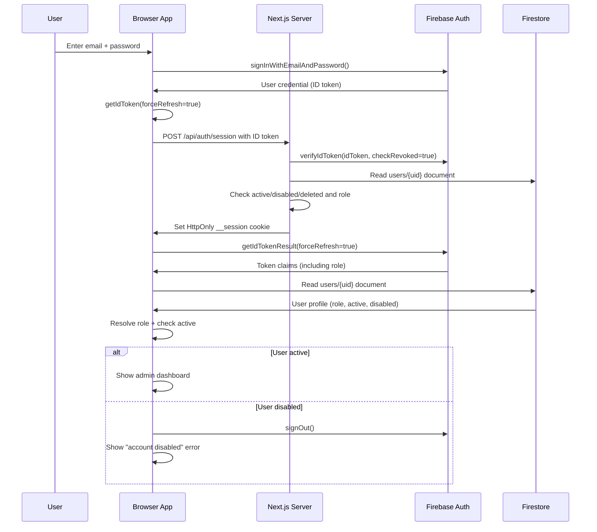
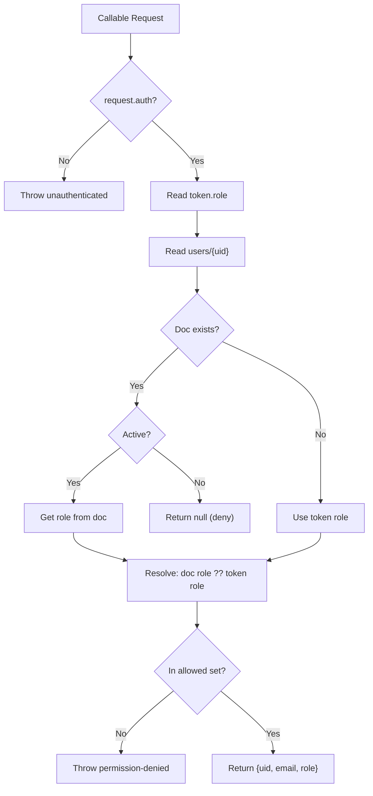

# Authentication & Authorization

## Overview

The AHM Admin Dashboard uses **Firebase Authentication** for identity
management and Firestore-backed RBAC for authorization. Roles are stored
as custom claims on the Firebase Auth user and mirrored in a Firestore
`users/{uid}` document. Server-side Next.js code requires a verified
Firebase session cookie and an active Firestore user document.

## Authentication Flow



## Firebase Client Initialization

**File:** `src/lib/firebase.ts`

The client initializes:

1. **Firebase App** — using hardcoded config for project
   `advanced-home-medical-55772`
2. **App Check** — reCAPTCHA Enterprise provider with auto-refresh
   - Site key from `NEXT_PUBLIC_FIREBASE_APPCHECK_SITE_KEY`
   - Debug token in development mode
3. **Auth** — `getAuth(app)` with `browserLocalPersistence`
4. **Firestore** — `getFirestore(app)`
5. **Functions** — `getFunctions(app, "us-central1")`
6. **Storage** — `getStorage(app)`

## Firebase Admin Initialization

**File:** `src/lib/firebaseAdmin.ts`

The server-side Admin SDK is initialized through
`src/lib/firebaseAdmin.ts`. Initialization is idempotent and first reuses
an existing Admin app when one is already present.

Credential resolution order:

1. Existing initialized Firebase Admin app
2. Application Default Credentials when the runtime indicates ADC support
   (`GOOGLE_APPLICATION_CREDENTIALS` or Google/Firebase managed-runtime
   env such as `K_SERVICE`, `GAE_SERVICE`, or `FUNCTION_TARGET`)
3. Explicit service-account credentials from environment variables:
   `FIREBASE_SERVICE_ACCOUNT_JSON`, or the discrete
   `FIREBASE_PROJECT_ID`, `FIREBASE_CLIENT_EMAIL`,
   `FIREBASE_PRIVATE_KEY` set
4. Local-development file fallback only when
   `FIREBASE_ADMIN_SERVICE_ACCOUNT_PATH` is set and `NODE_ENV` is not
   `production`

Production does not require `serviceAccountKey.json` in the repository
root, and emulator tests refuse to run while such a file exists. Local
service-account files, when needed for non-emulator development scripts, must
live outside the repository such as
`C:\Users\pboyl\.firebase-credentials\advanced-home-medical-service-account.json`.
Missing or invalid credentials throw a controlled
`FirebaseAdminInitializationError` without logging credential contents.

## Role System

**Single source of truth:** `src/lib/permissions/roles.ts`

### Roles

| Role | Hierarchy | Description |
|---|---|---|
| `read-only` | 0 | Read-only access to operational data |
| `billing` | 1 | Billing access (read + billing write) |
| `technician` | 2 | Field technician (inventory + patient write) |
| `staff` | 3 | Standard operational access |
| `manager` | 4 | Management access (includes settings + audit) |
| `tank` | 5 | Super-admin (includes employee evaluations) |
| `admin` | 6 | Full access |

### Permission System

The RBAC system defines discrete permissions:

```
access:command-center, access:audit-logs, access:settings
inventory:read, inventory:write
orders:read, orders:write
patients:read, patients:write
reports:read, reports:upload, reports:delete
rentals:read, rentals:write
rolodex:read, rolodex:write
billing:read, billing:write
admin:users, admin:roles
audit:read
```

### Role-Permission Matrix

| Permission | read-only | billing | technician | staff | manager | tank | admin |
|---|---|---|---|---|---|---|---|
| access:command-center | ✓ | ✓ | ✓ | ✓ | ✓ | ✓ | ✓ |
| access:audit-logs | — | — | — | — | — | ✓ | ✓ |
| access:settings | — | — | — | — | ✓ | ✓ | ✓ |
| inventory:read | ✓ | ✓ | ✓ | ✓ | ✓ | ✓ | ✓ |
| inventory:write | — | — | ✓ | ✓ | ✓ | ✓ | ✓ |
| orders:read | ✓ | ✓ | ✓ | ✓ | ✓ | ✓ | ✓ |
| orders:write | — | ✓ | ✓ | ✓ | ✓ | ✓ | ✓ |
| patients:read | ✓ | ✓ | ✓ | ✓ | ✓ | ✓ | ✓ |
| patients:write | — | — | ✓ | ✓ | ✓ | ✓ | ✓ |
| reports:read | ✓ | ✓ | ✓ | ✓ | ✓ | ✓ | ✓ |
| reports:upload | — | — | ✓ | ✓ | ✓ | ✓ | ✓ |
| reports:delete | — | — | — | — | ✓ | ✓ | ✓ |
| rentals:read | ✓ | ✓ | ✓ | ✓ | ✓ | ✓ | ✓ |
| rentals:write | — | — | ✓ | ✓ | ✓ | ✓ | ✓ |
| rolodex:read | ✓ | ✓ | ✓ | ✓ | ✓ | ✓ | ✓ |
| rolodex:write | — | — | ✓ | ✓ | ✓ | ✓ | ✓ |
| billing:read | — | ✓ | — | — | ✓ | ✓ | ✓ |
| billing:write | — | ✓ | — | — | — | ✓ | ✓ |
| admin:users | — | — | — | — | — | ✓ | ✓ |
| admin:roles | — | — | — | — | — | ✓ | ✓ |
| audit:read | — | — | — | — | ✓ | ✓ | ✓ |

### Temporary Tank Access

The system supports temporary elevation to `tank` role:

```typescript
if (data.temporaryTankAccess === true) {
  const previousRole = parseRole(data.previousRole);
  if (previousRole === "admin" || previousRole === "tank") {
    return "tank";
  }
}
```

This allows an admin to temporarily gain tank-level access (e.g., for
employee evaluations) and revert later.

## Client-Side Auth: `useAuthRole` Hook

**File:** `src/app/hooks/useAuthRole.ts`

This hook manages the entire client-side authentication state:

1. Subscribes to `onAuthStateChanged(auth, callback)`
2. On user sign-in:
   - Force-refreshes the ID token (`getIdTokenResult(currentUser, true)`)
   - Reads the `users/{uid}` document from Firestore
   - Checks if the user is active (`active !== false`, `disabled !== true`, `deleted !== true`)
   - Resolves the role (Firestore doc role takes priority over token role)
   - Caches the role for 60 seconds (`ROLE_CACHE_TTL_MS = 60_000`)
3. On disabled user:
   - Signs out the user
   - Shows "This account has been disabled."
4. Returns computed permission flags:
   - `isAdmin`, `isStaff`, `isTank`, `isAdminOrStaff`
   - `canAccessCommandCenter`, `canUploadReports`, `canRefreshImports`
   - `canDeleteImports`, `canReadAuditLogs`

### Role Cache

The hook uses a module-level cache (`roleCache`) to avoid re-fetching the
user's role on every render. The cache is keyed by `uid` and has a 60-second
TTL. It is cleared on sign-out, disabled user detection, or errors.

## Server-Side Auth Guards

### `requireUser()` — Server Components

**File:** `src/lib/auth/require-user.ts`

`requireUser()`, `requireRole()`, and `requirePermission()` read the
HttpOnly `__session` cookie through `src/lib/auth/session.ts`. The cookie
is verified with `adminAuth.verifySessionCookie(cookie, true)` so revoked
sessions are rejected. The helper then loads `users/{uid}` from Firestore
and rejects the request when the document is missing, inactive, disabled,
deleted, or does not resolve to a valid role.

Server-side roles are resolved through `src/lib/permissions/roles.ts`.
The Firestore user document role takes precedence over the verified token
claim, matching the dashboard's client and API authorization helpers.
Client-provided role values are never trusted.

Unauthenticated server components redirect to `/login`. Authenticated
users that fail role or permission checks redirect to `/unauthorized`.

### Session CSRF Protection

**Files:** `src/app/api/auth/session/route.ts`,
`src/lib/auth/session-csrf.ts`

`POST /api/auth/session` and `DELETE /api/auth/session` are protected by
server-side origin validation before token verification or cookie clearing
runs. SameSite cookies are not the only CSRF control.

Trusted origins must be configured with `AUTH_TRUSTED_ORIGINS` as a
comma-separated list of exact HTTPS origins, for example:

```text
AUTH_TRUSTED_ORIGINS=https://app.advhomemed.com
```

Rules:

- Wildcards are not supported.
- Trailing slashes are normalized.
- Invalid entries fail closed.
- Production fails closed if no trusted origin is configured.
- Localhost origins are accepted only outside production.

When the app is deployed behind Cloudflare or another trusted reverse
proxy, set `AUTH_TRUST_PROXY_HEADERS=true` only if the app is not directly
reachable except through that proxy. With that setting, the session CSRF
check can use `x-forwarded-host` and `x-forwarded-proto`; otherwise those
headers are ignored to avoid spoofing.

### Rate Limiting And Abuse Protection

**Files:** `src/lib/security/rate-limit.ts`,
`functions/src/security/rateLimit.ts`

API routes and high-cost callable functions use Firestore-backed token buckets.
Buckets are keyed by policy, scope, and a SHA-256 hash of the client identifier;
raw IP addresses, API keys, and user IDs are not stored in the bucket document
ID.

Policies:

- `login` - verified user session creation attempts.
- `session` - public IP bucket for `POST /api/auth/session`.
- `ai` - ChatGPT/Jarvis/product enrichment/code-fix operations.
- `import` - import screening, reprocessing, and analytics rebuilds.
- `general` - ordinary authenticated API and inventory callable traffic.
- `admin` - privileged user management, role/password operations, and reset or
  rebuild callables.

The limiter fails closed. If the backing store is unavailable, protected HTTP
routes return `429` with a generic body and `Retry-After`; callable functions
throw `resource-exhausted` with a generic message. Set
`RATE_LIMIT_TRUST_PROXY_HEADERS=true` only when traffic reaches the app
exclusively through the trusted Cloudflare path; otherwise forwarded IP headers
are ignored.

### `requireApiAuth()` — API Routes

**File:** `src/lib/auth/require-api-auth.ts`

This is a **properly implemented** Firebase ID token verification guard
for Next.js API routes:

1. Extracts `Bearer` token from `Authorization` header
2. Verifies the token with `adminAuth.verifyIdToken(token)`
3. Fetches the `users/{uid}` document from Firestore
4. Checks the user is active
5. Parses and validates the role
6. Returns `{ ok: true, uid, email, role }` or `{ ok: false, response }`

**Helper functions:**

| Function | Purpose |
|---|---|
| `requireApiAuth(request)` | Verify token + fetch user + check active |
| `requireApiRole(request, allowedRoles)` | Auth + role check |
| `requireApiPermission(request, ...permissions)` | Auth + permission check |

### MFA

**File:** `src/lib/auth/mfa.ts`

A TOTP (Time-based One-Time Password) MFA flow is implemented but **not
enforced** in any guard. The flow supports:

- TOTP secret generation
- QR code provisioning
- MFA enrollment
- MFA challenge verification

## Cloud Functions Authorization

### Inventory Functions

**File:** `functions/src/inventory/auth.ts`

`requireStaffOrAdmin(request)` — used by all inventory and domain workflow
callable functions:

1. Checks `request.auth` is present
2. Resolves role via `resolveCallableRole()` (Firestore doc → token claim)
3. Checks role is in `{admin, staff, tank}` set
4. Returns `{ uid, email, role }` or throws `HttpsError`

### Admin Functions

**File:** `functions/src/auth/roles.ts`

| Function | Purpose |
|---|---|
| `resolveCallableRole(auth)` | Resolve role from Firestore doc or token |
| `requireCallableAdmin(auth, message)` | Require admin or tank role |
| `requireCallableStaffOrAdmin(auth, message)` | Require staff, admin, or tank |

### Role Resolution in Cloud Functions



## User Management

### User Creation

**Callable:** `createDashboardUser` (`functions/src/adminUsers.ts`)

Admin-only function that:
1. Verifies the caller is admin
2. Validates email, password (min 8 chars), displayName, role
3. Creates the Firebase Auth user
4. Sets custom claims `{ role }` on the user
5. Creates `users/{uid}` Firestore document
6. Writes audit log

### User Management Functions

**File:** `functions/src/adminUserManagement.ts`

| Callable | Purpose |
|---|---|
| `updateUserRole` | Update user's role (custom claims + Firestore) |
| `disableDashboardUser` | Disable user account (Auth + Firestore) |
| `enableDashboardUser` | Enable user account (Auth + Firestore) |
| `deleteUserAccount` | Delete user (Auth delete + Firestore mark deleted) |
| `resetUserPassword` | Reset user password (min 8 chars) |

All functions:
- Require admin role
- Prevent self-disable and self-delete
- Write audit logs

### Bootstrap Admin

**File:** `functions/src/bootstrapAdmin.ts`

`bootstrapAdminClaim` — a one-time function that sets the admin role on a
specific hardcoded UID (`njLGR1oBWdMw5SJjmZGzMb4xtcj2`). This is used to
bootstrap the first admin user.

## Firestore Security Rules Authorization

The Firestore rules (`firestore.rules`) implement authorization at the
database level. See [FIRESTORE.md](./FIRESTORE.md) for the full rules
documentation.

Key points:
- Only `admin`, `tank`, and `staff` roles are recognized by Firestore rules
- The `role()` function resolves from custom claims first, then Firestore profile
- Active user check: `active != false && disabled != true && deleted != true`
- Protected fields prevent client-side modification of workflow state
- `auditLogs`, `inventoryTransactions`, and `inventoryOperations` are
  write-only from Cloud Functions (client cannot create/update/delete)

## Storage Rules Authorization

The Storage rules (`storage.rules`) use the same role resolution:
- `tokenRole()` — from custom claims
- `docRole()` — from Firestore `users/{uid}` document
- `canAccessDashboard()` — signed in + staff/admin
- `canAdminWrite()` — signed in + admin

> **Note:** Storage rules intentionally do NOT check `user.active` to avoid
> Firestore lookup instability during uploads. Inactive-user blocking is
> handled in frontend auth/session logic.

## App Check

Firebase App Check is initialized in `src/lib/firebase.ts`:

- **Provider:** reCAPTCHA Enterprise
- **Site key:** `NEXT_PUBLIC_FIREBASE_APPCHECK_SITE_KEY` (env var)
- **Debug token:** `NEXT_PUBLIC_FIREBASE_APPCHECK_DEBUG_TOKEN` (dev only)
- **Auto-refresh:** enabled

If the site key is missing, App Check is skipped with a console warning.

## ChatGPT Bridge Auth

**File:** `src/lib/chatgpt-bridge/auth.ts`

A separate auth mechanism for the ChatGPT bridge API route. This provides
Firestore query access via an API key, separate from the Firebase Auth
system.

> **Known issue:** The ChatGPT bridge provides unfiltered Firestore access
> with no PII masking, flagged in `PRODUCTION_READINESS.md`.

## Known Auth Gaps

Based on `PRODUCTION_READINESS.md`:

1. **CSRF protection is partial** — the session-cookie endpoint validates
   trusted origins, but other state-changing API routes still need CSRF
   protection
2. **Rate limiting is partial** — session creation, selected API routes, and
   high-cost callables now use token buckets; remaining direct client
   Firestore write paths still need abuse controls
3. **MFA not enforced** — TOTP flow exists but no guard requires it
4. **Session management** — Firebase session cookies are established for
   server-side auth, but idle timeout and sensitive-action reauth are not
   implemented
