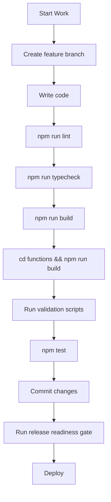

# Development

## Getting Started

### Prerequisites

- **Node.js** (compatible with Next.js 16.2.3)
- **npm** (package manager)
- **Firebase CLI** (`npm install -g firebase-tools`)
- **PostgreSQL** (for Prisma/relational data)
- **PowerShell 7+** (for validation scripts)

### Installation

```bash
# Install root dependencies
npm install

# Install Cloud Functions dependencies
cd functions && npm install
```

### Environment Setup

1. **Set environment variables:**
   - `DATABASE_URL` — PostgreSQL connection string
   - `NEXT_PUBLIC_FIREBASE_APPCHECK_SITE_KEY` — reCAPTCHA Enterprise site key
   - `NEXT_PUBLIC_FIREBASE_APPCHECK_DEBUG_TOKEN` — App Check debug token (dev)
   - For Next.js Firebase Admin access, prefer
     `FIREBASE_SERVICE_ACCOUNT_JSON` as a local secret. Alternatively, set
     `FIREBASE_ADMIN_SERVICE_ACCOUNT_PATH` to a local service-account JSON
     file outside this repository. The path fallback is refused in
     production and is not deployed.
   - `AUTH_TRUSTED_ORIGINS` is optional outside production. When omitted,
     the session endpoint accepts local development origins such as
     `http://localhost:3000`. Set it explicitly when testing a custom local
     host name.
   - Rate limiting is enabled in development. Use `RATE_LIMIT_*_LIMIT` and
     `RATE_LIMIT_*_WINDOW_SECONDS` overrides when testing burst behavior. Do
     not set `RATE_LIMIT_TRUST_PROXY_HEADERS=true` locally unless you are
     explicitly testing trusted Cloudflare headers.

2. **Generate Prisma client:**
   ```bash
   npx prisma generate
   ```

3. **Apply Prisma migrations:**
   ```bash
   npx prisma migrate deploy
   ```

### Running the Development Server

```bash
npm run dev
```

Open [http://localhost:3000](http://localhost:3000).

### Running Firebase Emulators

```bash
# Functions only
cd functions && npm run serve

# Full emulator suite
firebase emulators:start
```

## Project Structure

See [PROJECT.md](./PROJECT.md) for the full directory structure.

### Key Directories

| Directory | Purpose |
|---|---|
| `src/app/` | Next.js App Router pages and API routes |
| `src/app/(admin)/` | Authenticated admin pages |
| `src/app/(auth)/` | Login and password reset |
| `src/app/api/` | Next.js API routes |
| `src/components/` | Shared UI components |
| `src/lib/` | Core libraries (firebase, auth, permissions, workflows) |
| `src/repositories/` | Data access layer (Firestore + Postgres) |
| `src/services/` | Business logic services |
| `src/theme/` | Design token system |
| `functions/src/` | Cloud Functions source |
| `scripts/` | Validation, seeding, and maintenance scripts |
| `prisma/` | Prisma schema and migrations |

## Development Workflow



### Daily Development Commands

```bash
# Start dev server
npm run dev

# Quick validation (lint + typecheck)
npm run lint && npm run typecheck

# Full validation
npm run verify

# Run tests
npm test

# Run tests in watch mode
npm run test:watch

# Run tests with coverage
npm run test:coverage

# Build Cloud Functions
cd functions && npm run build

# Watch Cloud Functions compilation
cd functions && npm run watch
```

## Validation Scripts

### Static Analysis: Protected Field Writes

Two Node.js scripts enforce that protected fields are only written from
authorized service files:

#### `validate:inventory-writes`

```bash
npm run validate:inventory-writes
```

**Script:** `scripts/validate-inventory-writes.cjs`

Scans all `.ts`, `.tsx`, `.js`, `.cjs`, `.mjs` files for direct writes
to protected inventory fields outside the authorized files.

**Protected fields:**
```
quantityOnHand, available, onRent, onTruck, committed, allocated, reserved,
patientId, patientKey, patientName, rentalId, locationId, warehouseId,
status, inventoryStatus, rentalStatus, assignmentStatus, lifecycleStatus,
isDeleted, deleted, deletedAt, archived, discontinued
```

**Authorized files (allowlist):**
- `functions/src/inventory/movementService.ts`
- `functions/src/inventory/inventoryTransactionService.ts`
- `functions/src/domainWorkflows/deliveryWorkflowService.ts`
- `functions/src/domainWorkflows/rentalWorkflowService.ts`
- `functions/src/domainWorkflows/patientEquipmentWorkflowService.ts`
- `functions/src/domainWorkflows/patientLifecycleWorkflowService.ts`
- `src/repositories/firestore/product.repository.ts`

**How it works:**
1. Walks the file tree (excluding `node_modules`, `.next`, `.codex-backups`, `functions/lib`, `.kilo`, `coverage`)
2. For each file, checks focused sliding windows
3. Flags files that simultaneously contain:
   - A Firestore write call or generic helper call (`updateDoc`, `setDoc`, `addDoc`, `writeBatch`, `runTransaction`, `safeUpdateDocument`, `safeSetDocument`, `commitChunkedSets`)
   - A protected field name
   - An inventory-scoped reference (`inventory`)
4. Exits with code 1 if violations found

Client metadata helpers must call
`src/lib/inventory/protectedFields.ts` before writing inventory documents.
Do not add live client inventory write modules to the allowlist; route
protected state changes through callable workflows instead.

#### `validate:domain-writes`

```bash
npm run validate:domain-writes
```

**Script:** `scripts/validate-domain-writes.cjs`

Scans for direct writes to protected domain workflow fields outside the
authorized workflow service files.

**Protected fields include:**
- Delivery workflow fields (scan counts, fulfillment status, signature, route)
- Rental workflow fields (status, patient/inventory linkage, checkout/return/cancel metadata)
- Patient equipment fields (inventory/product linkage, assignment, closure, delivery linkage, movement)
- Patient lifecycle fields (archive, restore, destroy)

**Authorized files (allowlist):**
- `functions/src/domainWorkflows/*.ts` (all workflow services)
- `functions/src/inventory/movementService.ts` for server-authored inventory movement side effects
- `functions/src/patientDocuments/processPatientDocumentFromStorage.ts`
- `src/lib/domainWorkflows.ts`
- `src/lib/__tests__/domain-write-validation.test.ts`

**Additional checks:**
- Flags direct storage uploads to final workflow paths (signatures, damage-photos)
- Flags two-phase rental checkout patterns outside workflow services
- Flags protected rental and `patients/{id}/equipment` writes through
  `safeUpdateDocument`, `safeSetDocument`, `commitChunkedSets`, and other
  generic write helpers

Client rental metadata writes must call `src/lib/domain/protectedFields.ts`.
Direct rental creates are limited to `draft` metadata. Checked-out rental
creation, returns, exchanges, cancellations, and patient-equipment state changes
must use the callable wrappers in `src/lib/domainWorkflows.ts`.

### Import Verification

```bash
npm run verify:imports
```

Runs `scripts/verify-import-routing.ts` to verify import routing
configuration.

### PowerShell Validation Toolkit

See [DEVELOPMENT-VALIDATION.md](../DEVELOPMENT-VALIDATION.md) for full
documentation of the PowerShell validation toolkit.

| Script | Purpose |
|---|---|
| `scripts/Invoke-ProjectValidation.ps1` | Lint + typecheck + build + functions build |
| `scripts/Get-ProjectHealth.ps1` | Read-only project health snapshot |
| `scripts/Get-ReleaseReadiness.ps1` | Pre-release gate (Git hygiene + validation) |

All PowerShell scripts:
- Require PowerShell 7.0+
- Use `Set-StrictMode -Version Latest`
- Use `$ErrorActionPreference = 'Stop'`
- Never display environment file contents
- Never install packages
- Never deploy

## Seeding and Import Scripts

| Script | Command | Purpose |
|---|---|---|
| `scripts/seedBrightreeReferences.ts` | `npm run seed:brightree` | Seed Brightree reference data |
| `scripts/seedRolodexDoctors.ts` | `npm run seed:rolodex:doctors` | Seed rolodex doctors |
| `scripts/seedRolodexFacilities.ts` | `npm run seed:rolodex:facilities` | Seed rolodex facilities |
| `scripts/import-par-report.ts` | `npm run import:par` | Import PAR report |
| `scripts/import-hcpcs-dhs-codes.cjs` | `npm run import:hcpcs` | Import HCPCS/DHS codes |
| `scripts/repairUsers.ts` | `npm run repair:users` | Repair user accounts |
| `scripts/verify-import-routing.ts` | `npm run verify:imports` | Verify import routing |
| `scripts/backfill-cpap-equipment.tsx` | — | Backfill CPAP equipment |
| `scripts/backfill-inventory-barcodes.ts` | — | Backfill inventory barcodes |
| `scripts/cleanupWipRecords.ts` | — | Clean up WIP records |
| `scripts/inspect-phiAlerts.ts` | — | Inspect PHI alerts |
| `scripts/phi-clear-open-alerts.ts` | — | Clear open PHI alerts |
| `scripts/setAdminClaim.js` | — | Set admin custom claim manually |

### Maintenance Scripts

| Script | Purpose |
|---|---|
| `scripts/call-rebuild-everything.cjs` | Call rebuildEverything function |
| `scripts/call-rebuild-reports-analytics.cjs` | Call rebuildReportsAnalytics function |
| `scripts/reset-rebuild-targets-local.cjs` | Reset rebuild targets locally |
| `scripts/run-rebuild-everything-local.cjs` | Run rebuild locally |
| `scripts/count-import-queue.cjs` | Count import queue entries |
| `scripts/count-operational-collections.cjs` | Count operational collections |
| `scripts/inspect-firestore-imports.cjs` | Inspect Firestore imports |
| `scripts/inspect-import-queue-all.cjs` | Inspect all import queue entries |

## Code Style and Conventions

### TypeScript

- **Strict mode** enabled in both app and functions
- **Path alias:** `@/*` maps to `./src/*` (app only)
- **Module resolution:** `bundler` (app), `nodenext` (functions)
- **JSX:** `react-jsx` (app)

### ESLint

- **App:** `eslint-config-next` + `eslint-plugin-react` + `eslint-plugin-react-hooks`
- **Functions:** `eslint-config-google` + `@typescript-eslint`

### Architecture Conventions

From `docs/v2-architecture.md`:

| Layer | Page/Component Size |
|---|---|
| Pages | 200-400 lines preferred |
| Components | Under 200 lines preferred |
| Hooks | 100-250 lines preferred |
| Services | Under 300 lines preferred |

### Dependency Direction

**Allowed:** `UI → Hooks → Services → Repositories → Database`

**Not allowed:**
- Repositories → Services
- Services → UI / React
- Database code inside page components

## Firebase Emulator Setup

### Local Development with Emulators

```bash
# Start Firestore + Auth emulators
firebase emulators:start --only firestore,auth

# Run functions with emulators
cd functions && npm run serve

# Run emulator-based integration tests
npm run emulators:test
```

### Emulator Configuration

The integration test config (`functions/vitest.integration.config.ts`)
sets these emulator environment variables:

```
FIRESTORE_EMULATOR_HOST=localhost:8080
FIREBASE_AUTH_EMULATOR_HOST=localhost:9099
GCLOUD_PROJECT=demo-advanced-home-medical
```

Emulator tests are credential-free. They initialize Firebase Admin with only
the isolated `demo-*` project ID and local emulator host variables. The safety
guard in `functions/src/test-utils/emulator-setup.ts` fails fast when:

- `FIRESTORE_EMULATOR_HOST` or `FIREBASE_AUTH_EMULATOR_HOST` is missing
- an emulator host does not point to localhost
- `GCLOUD_PROJECT` is missing or does not start with `demo-`
- `GOOGLE_APPLICATION_CREDENTIALS`, `FIREBASE_SERVICE_ACCOUNT_JSON`,
  `FIREBASE_ADMIN_SERVICE_ACCOUNT_PATH`, `FIREBASE_CLIENT_EMAIL`, or
  `FIREBASE_PRIVATE_KEY` is set for emulator tests
- `serviceAccountKey.json` exists in the repository root or `functions/`

Keep local service-account files outside the repository. If a non-emulator
local admin script genuinely needs a key, use:

```powershell
New-Item -ItemType Directory -Force "$env:USERPROFILE\.firebase-credentials"
Move-Item -LiteralPath .\serviceAccountKey.json -Destination "$env:USERPROFILE\.firebase-credentials\advanced-home-medical-service-account.json"
$env:FIREBASE_ADMIN_SERVICE_ACCOUNT_PATH = "$env:USERPROFILE\.firebase-credentials\advanced-home-medical-service-account.json"
```

## Git Workflow

### Branching

- Feature branches from `main`
- Clean working tree required for release gate
- Use `-AllowDirty` flag when validating uncommitted work

### Pre-Commit

```powershell
# Quick check
.\scripts\Invoke-ProjectValidation.ps1 -SkipBuild -SkipFunctions

# Full check
.\scripts\Invoke-ProjectValidation.ps1
```

### Pre-Push / Pre-Release

```powershell
# Full release gate
.\scripts\Get-ReleaseReadiness.ps1

# Health check
.\scripts\Get-ProjectHealth.ps1
```

## Backup Files

The repository contains `.bak-*` files (e.g., `firestore.rules.bak-20260730-140509`).
These are timestamped backups of configuration files. The validation
scripts skip `.bak-` files and `.codex-backups/` during scanning.

## Known Development Issues

1. **No `.env.example`** — developers must infer env vars from code
2. **Duplicate error files** — `errors.ts` and `getErrorMessage.ts` are identical
3. **`tsconfig.json` duplicate exclude** — the `exclude` array appears twice
4. **`adhoc-samples/`** — contains sample data files that should not be in production
