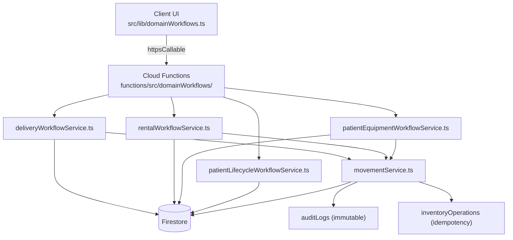
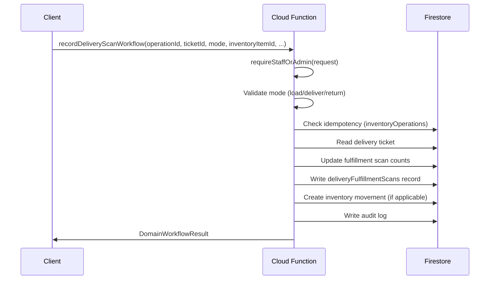
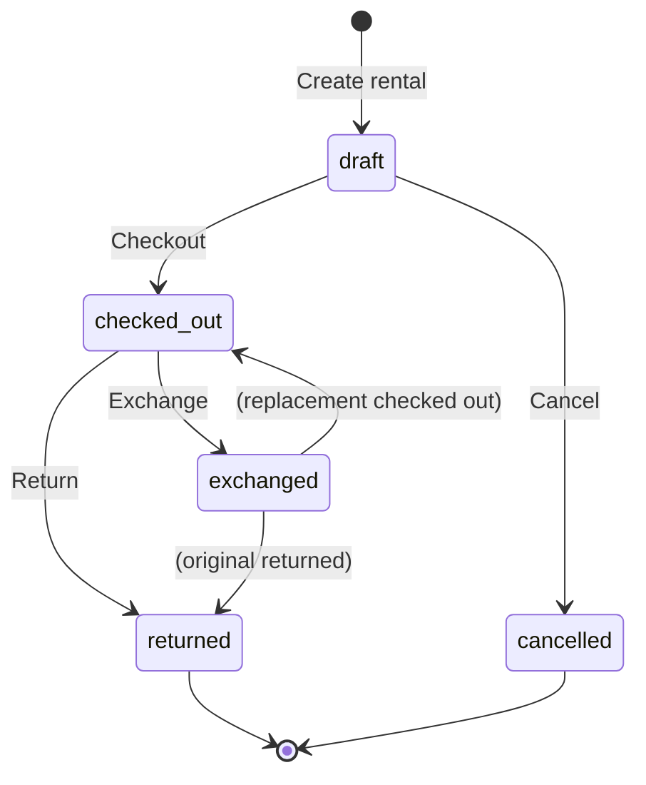
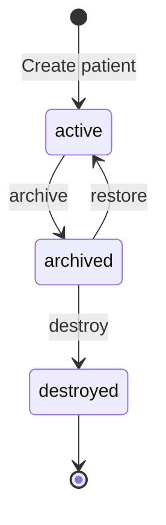
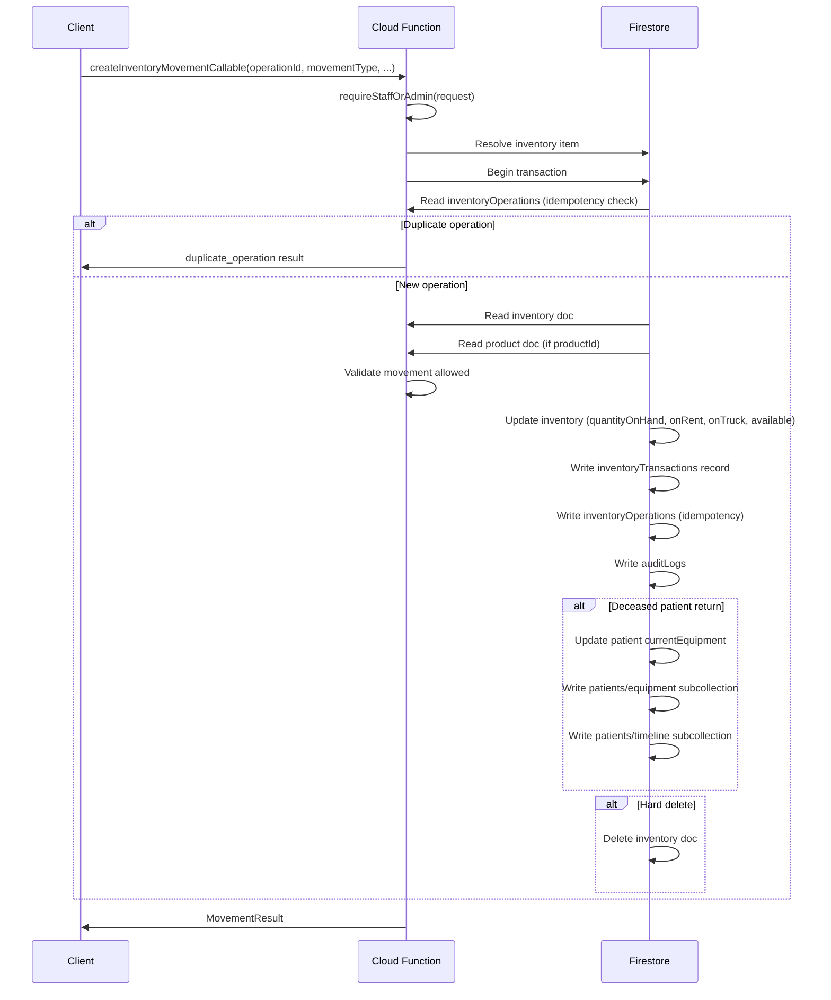
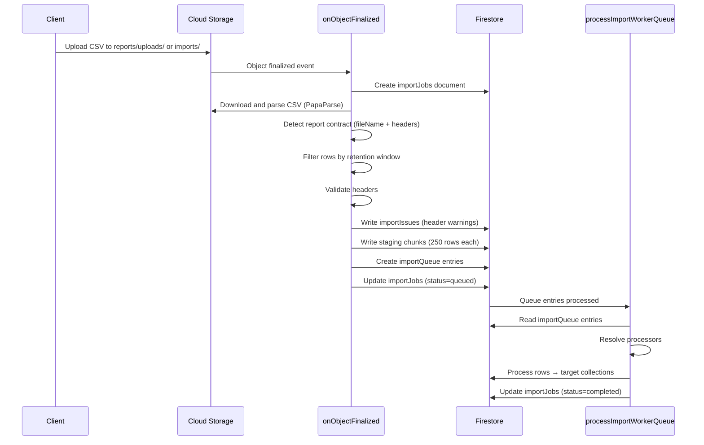
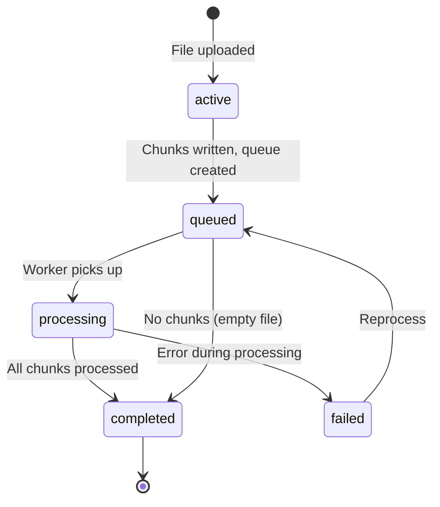
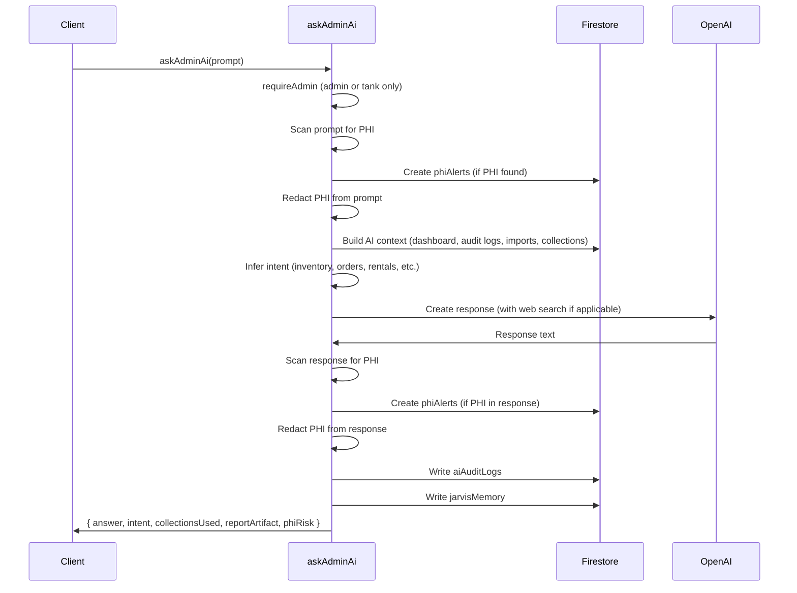

# Domain Workflows — Server-Side Business Logic

## Overview

All high-risk state transitions in the AHM Admin Dashboard are handled by
**Firebase Cloud Functions** using callable functions. The client never
directly modifies protected workflow fields. Instead, it calls typed
wrapper functions in `src/lib/domainWorkflows.ts` that invoke the
corresponding Cloud Function.

The validation scripts (`validate-domain-writes.cjs` and
`validate-inventory-writes.cjs`) enforce this boundary at build time by
scanning all source files for direct writes to protected fields outside
the authorized service files.

Client runtime helpers also enforce the boundary before writes reach Firestore:
`src/lib/domain/protectedFields.ts` rejects protected rental and
patient-equipment fields in generic safe actions, chunked write queues, and the
rentals page metadata path.

Inventory metadata may still be edited from the client when it does not touch
protected state. Protected inventory state includes quantities, availability,
patient/rental assignment, warehouse/location assignment, status/lifecycle
fields, and deletion/archive/discontinued flags. Those changes must use
`createInventoryMovementCallable`, inventory transaction callables, or domain
workflow callables.

## Workflow Architecture



## Idempotency Pattern

Every workflow operation requires an `operationId` — a client-generated
unique identifier (8-160 chars, alphanumeric + hyphens/underscores).
The Cloud Function stores a fingerprint of the request in the
`inventoryOperations` collection keyed by `{actorUid}_{operationId}`.

If the same `operationId` is submitted again:

1. The existing operation record is fetched
2. The request fingerprint is compared
3. If fingerprints match → returns `duplicate_operation` status
4. If fingerprints differ → throws `failed-precondition` error

This makes all workflow operations safely retryable.

## Workflow Result Type

All workflows return a `DomainWorkflowResult`:

```typescript
type DomainWorkflowResult = {
  status: "success" | "duplicate_operation" | "not_found" | "invalid"
        | "permission_denied" | "invalid_state" | "insufficient_quantity"
        | "asset_unavailable" | "dependency_conflict" | "validation_error";
  operationId: string;
  workflowType: string;
  message?: string;
  movementIds?: string[];
  rentalId?: string;
  assignmentId?: string;
  metadata?: Record<string, unknown>;
};
```

## Delivery Workflow

**Service:** `functions/src/domainWorkflows/deliveryWorkflowService.ts`
**Callable:** `functions/src/domainWorkflows/domainWorkflowFunctions.ts`

### Delivery Scan Workflow

`recordDeliveryScanWorkflowCallable` — records a scan event for a delivery
ticket line item.

**Modes:**

| Mode | Description |
|---|---|
| `load` | Item loaded onto truck |
| `deliver` | Item delivered to patient |
| `return` | Item returned from delivery |

**Flow:**



### Delivery Ticket Completion

`completeDeliveryTicketWorkflowCallable` — marks a delivery ticket as
completed after all scans are verified.

### Delivery Signature Finalization

`finalizeDeliverySignatureWorkflowCallable` — finalizes a delivery
signature by moving the pending upload from `workflow-pending/delivery/`
to `patient-documents/` and recording the signature metadata.

**Two-phase upload pattern:**

1. Client uploads signature image to `workflow-pending/delivery/{ticketId}/signatures/`
2. Client calls the callable function with the pending storage path
3. Cloud Function moves the file to the final location and records metadata

### Delivery Damage Photos Finalization

`finalizeDeliveryDamagePhotosWorkflowCallable` — finalizes damage photos
using the same two-phase upload pattern. Supports multiple files per call.

### Delivery Tech Check-In

`deliveryTechCheckInWorkflowCallable` — records a delivery technician's
GPS location (latitude, longitude, accuracy) for a delivery ticket.

### Delivery Route Update

`updateDeliveryRouteWorkflowCallable` — updates route information (ETA,
sequence, status, notes) for a delivery ticket.

## Rental Workflow

**Service:** `functions/src/domainWorkflows/rentalWorkflowService.ts`

### Rental Checkout

`checkoutRentalWorkflowCallable` — checks out a rental by:
1. Creating or updating the rental record with `checked_out` status
2. Creating an inventory movement (`rental_checkout`)
3. Updating inventory status to `rental_out`
4. Writing audit log

### Create and Checkout Rental

`createAndCheckoutRentalWorkflowCallable` — creates a new rental record
and immediately checks it out in a single atomic operation.

Direct browser-created rental records are limited to draft metadata. The
rentals page must use this callable whenever the requested initial state is
`checked_out`; client Firestore writes cannot set rental patient linkage,
inventory linkage, movement IDs, checkout, return, or cancellation fields.

### Rental Return

`returnRentalWorkflowCallable` — returns a rental by:
1. Updating rental status to `returned`
2. Creating an inventory movement (`rental_return`)
3. Updating inventory status to `available`
4. Clearing patient/rental assignment on inventory
5. Writing audit log

### Rental Exchange

`exchangeRentalWorkflowCallable` — exchanges one rental item for another:
1. Returns the original item (rental_return movement)
2. Checks out the replacement item (rental_checkout movement)
3. Updates both inventory items
4. Writing audit log

### Rental Cancellation

`cancelRentalWorkflowCallable` — cancels a rental:
1. Updates rental status to `cancelled`
2. If inventory was checked out, creates a return movement
3. Writing audit log

### Stale Rental Draft Reporting

`reportStaleRentalDraftsCallable` — admin-only function that identifies
rental drafts older than a configurable threshold (default 72 hours).
Supports dry-run mode and automatic repair.



## Patient Equipment Workflow

**Service:** `functions/src/domainWorkflows/patientEquipmentWorkflowService.ts`

`patientEquipmentWorkflowCallable` — manages equipment assignments to
patients.

All assignment state under `patients/{id}/equipment` is server-authored. Client
Firestore creates and updates cannot set inventory/product linkage, status,
assigned/closed actor timestamps, delivery linkage, movement IDs, return
timestamps, or `systemGenerated`.

**Actions:**

| Action | Description |
|---|---|
| `assign` | Assign equipment to a patient |
| `remove` | Remove equipment from a patient |
| `transfer` | Transfer equipment to another patient |
| `recover_deceased` | Return equipment from a deceased patient |
| `replace` | Replace one equipment item with another |
| `lost` | Mark equipment as lost |
| `damaged` | Mark equipment as damaged |
| `return_to_warehouse` | Return equipment to warehouse |

Each action:
1. Validates the action type
2. Resolves the inventory item
3. Creates appropriate inventory movement(s)
4. Updates `patients/{id}/equipment` subcollection
5. Updates `patients/{id}/timeline` subcollection
6. Writes audit log

## Patient Lifecycle Workflow

**Service:** `functions/src/domainWorkflows/patientLifecycleWorkflowService.ts`

`patientLifecycleWorkflowCallable` — manages patient lifecycle state
transitions.

**Actions:**

| Action | Description | Protected Fields Updated |
|---|---|---|
| `archive` | Archive a patient | `status`, `archivedAt`, `lifecycleUpdatedByUid`, `lifecycleUpdatedByEmail` |
| `restore` | Restore an archived patient | `status`, `restoredAt`, `lifecycleUpdatedByUid`, `lifecycleUpdatedByEmail` |
| `destroy` | Permanently destroy patient record | `status`, `destroyedAt`, `tombstoned`, `lifecycleUpdatedByUid`, `lifecycleUpdatedByEmail` |

**Features:**
- `dryRun` mode — returns a dependency report without making changes
- `confirmationToken` — required for destructive operations
- Dependency checking — verifies no active rentals, open orders, or
  pending deliveries before allowing lifecycle transitions



## Inventory Movement Workflow

**Service:** `functions/src/inventory/movementService.ts`

This is the core inventory state machine. All inventory quantity changes
go through `createInventoryMovement()` which uses Firestore transactions
for concurrency safety.

### Movement Types

| Movement Type | Quantity Delta | OnRent Delta | OnTruck Delta | Description |
|---|---|---|---|---|
| `receive` | +qty | 0 | 0 | Receive stock into inventory |
| `manual_adjustment` | explicit | 0 | 0 | Manual quantity adjustment |
| `patient_assignment` | 0 | +qty | 0 | Assign to patient |
| `rental_checkout` | 0 | +qty | 0 | Check out rental |
| `rental_return` | 0 | -qty | 0 | Return rental |
| `delivery_load` | 0 | 0 | +qty | Load onto truck |
| `delivery_delivered` | 0 | +qty | -qty | Deliver to patient |
| `delivery_returned` | 0 | -qty | 0 | Return from delivery |
| `damaged` | -qty | 0 | 0 | Mark as damaged |
| `lost` | -qty | 0 | 0 | Mark as lost |
| `found` | +qty | 0 | 0 | Found item |
| `discontinued` | 0 | 0 | 0 | Discontinue product |
| `archived` | 0 | 0 | 0 | Archive inventory item |
| `restored` | +qty | 0 | 0 | Restore archived item |
| `deceased_patient_equipment_return` | 0 | -qty | 0 | Return from deceased patient |
| `hard_delete` | 0 | 0 | 0 | Permanently delete (admin only) |
| `reversal` | — | — | — | Reverse a previous movement (admin only) |

### Movement Validation

Before a movement is applied, the service validates:

1. **Operation ID** — must match `^[a-zA-Z0-9_-]{8,160}$`
2. **Admin-only movements** — `hard_delete` and `reversal` require admin/tank role
3. **Inventory resolution** — resolves by `inventoryItemId` or barcode/serial/lot/sku
4. **Ambiguity check** — if multiple items match, returns `ambiguous` status with matches
5. **State validation:**
   - Deleted/archived items can only receive `restored` or `reversal`
   - Discontinued items can be returned but not newly issued
   - Quantity cannot go below zero
   - Available inventory cannot go negative
   - On-rent/on-truck cannot go negative
   - Serialized items cannot be checked out twice
6. **Fractional units** — only allowed if `supportsFractionalUnits` is true
7. **Hard delete dependencies** — checks for active rentals, orders, deliveries

### Transaction Flow



### Barcode Scanning Functions

| Callable | Purpose |
|---|---|
| `lookupInventoryByBarcode` | Look up inventory by barcode (read-only) |
| `receiveInventoryByBarcode` | Receive inventory by barcode scan |
| `issueInventoryByBarcode` | Issue inventory by barcode scan |
| `cycleCountInventoryByBarcode` | Cycle count by barcode scan |
| `transferInventoryByBarcode` | Transfer inventory by barcode scan |

All inventory callable entry points require authenticated staff/admin users
and consume the callable rate limiter before executing business logic.
Movement, lookup, receive, issue, cycle-count, and transfer callables use the
general policy; reconciliation uses the stricter admin policy.

### Scan Normalization

The `normalizeScanValue()` function in `movementService.ts` validates and
normalizes barcode scans:

- Trims whitespace and control characters
- Rejects empty scans
- Rejects URL-based QR codes
- Maximum 128 characters
- Rejects path characters (`/`, `.`, `..`)

## Import Pipeline Workflow

**Trigger:** `functions/src/imports/importFileFromStorage.ts`
**Worker:** `functions/src/imports/workers/processImportWorkerQueue.ts`

### Import Flow



### Import Components

| Component | File | Purpose |
|---|---|---|
| Storage trigger | `imports/importFileFromStorage.ts` | Triggered on file upload to `reports/uploads/` or `imports/` |
| Report contracts | `imports/reportContracts.ts` | Detect report type from filename + headers |
| Processors | `imports/resolveProcessors.ts` | Resolve processing functions for detected report type |
| Staging | `imports/staging/writeStagingChunks.ts` | Split rows into 250-row chunks |
| Queue | `imports/queues/createImportQueue.ts` | Create queue entries for each chunk |
| Worker | `imports/workers/processImportWorkerQueue.ts` | Process queue entries |
| Cleanup | `imports/cleanup/scheduledMaintenance.ts` | Scheduled cleanup of old import data |
| Retention | `importRetention.ts` | Filter rows by retention window |
| Reprocess | `imports/reprocessImportJobFromFirestore.ts` | Reprocess a failed import job |

### Import Job Lifecycle



## AI (Jarvis) Workflow

**Callable:** `functions/src/ai/callable/askAdminAi.ts`

### Jarvis Flow



### PHI Safety

The `functions/src/ai/phiSafety.ts` module provides:

- `scanTextForPhi(text, source)` — scans for phone numbers, emails, SSNs,
  insurance IDs, dates of birth
- `redactPhi(text)` — replaces detected PHI with `[REDACTED]`
- `createPhiAlert(db, params)` — creates a `phiAlerts` document for review

### Intent Classification

The `inferIntent()` function classifies prompts into intents:

| Intent | Trigger Keywords |
|---|---|
| `dme-deals-web-search` | deal, sale, clearance, discount + DME/equipment |
| `insurance-web-search` | insurance + change/update/requirement/authorization |
| `analysis-reporting` | export, report, graph, chart, forecast, margin |
| `phi-risk` | phi, hipaa, leak |
| `imports` | import, upload, stuck |
| `audit` | audit, security |
| `api-registry` | api, integration, tool, growth |
| `orders` | order |
| `rentals` | rental |
| `inventory` | inventory, product, stock, discontinued |
| `hospice` | hospice |
| `insurance` | insurance |
| `general` | (fallback) |

### Other AI Callables

| Callable | Purpose |
|---|---|
| `scanDatabasePhiSafety` | Scan Firestore collections for PHI exposure |
| `screenImportJobWithJarvis` | AI-screen import jobs for issues |

## Maintenance Workflows

| Callable | Purpose |
|---|---|
| `cleanDatabase` | Clean up orphaned/temporary data |
| `rebuildEverything` | Full rebuild of all derived data |
| `rebuildReportsAnalytics` | Rebuild reports and analytics |
| `reprocessImportJob` | Reprocess a specific import job |
| `softResetReports` | Soft reset report data |
| `resetOperationalDatabase` | Reset operational collections (destructive) |
| `cleanupPendingWorkflowUploadsCallable` | Clean up stale pending workflow uploads |

## QR Code Workflow

`trackQrScan` — records a QR code scan event. Creates a `qrScanEvents`
document with scan metadata.

## Patient Document Workflow

`processPatientDocumentFromStorage` — triggered by storage upload to
`patient-documents/`. Parses PDF delivery tickets and extracts structured
data.

## Rolodex Workflow

`searchRolodexContacts` — searchable contact directory query function.
